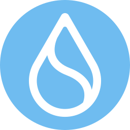

  

  

<h1 align="center">
</h1>

&nbsp;Senior web2 & web3 engineer with over 3+ years of experience in web3 world and for 7+ years in web, mobile and desktop applications design, development, and maintenance. Possesses diverse experience of creating multiple highly scalable applications using different tech stacks. Leaded successful transition from web2 stacks to combination of web2 & web3 stacks to improve web3 system performance which is the focus and the future of our life, so for now implemented <b>DApps</b>, <b>DeFi</b>, <b>NFT Marketplaces</b>, <b>NFT Mint Websites</b>, <b>Token Launchpads</b>. Have worked in all phases of the project life cycle, using a wide variety of tools and frameworks.

## Experienced Blockchain Networks

<table>
  <tr>
    <td align="center" width="96">
      
       Ethereum
    </td>
    <td align="center" width="96">
      
       Binance
    </td>
    <td align="center" width="96">
      
       Avalanche
    </td>
    <td align="center" width="96">
      
       Polygon
    </td>
    <td align="center" width="96">
      
       Cronos
    </td>
    <td align="center" width="96">
      
       Lukso
    </td>
    <td align="center" width="96">
      
       Solana
    </td>
    <td align="center" width="96">
      
       Sui
    </td>
    <td align="center" width="96">
      
       Aptos
    </td>
  </tr>
</table>
  
## Tools & languages

<table>
  <tr>
    <td align="center" width="96">
      
       JavaScript
    </td>
    <td align="center" width="96">
      
       TypeScript
    </td>
    <td align="center"  width="96">
      
       Solidity
    </td>
    <td align="center" width="96">
      
       Rust
    </td>
    <td align="center" width="96">
      
       Go
    </td>
    <td align="center" width="96">
      
       Python
    </td>
    <td align="center" width="96">
      
       NodeJs
    </td>
    <td align="center" width="96">
      
       React
    </td>
    <td align="center" width="96">
      
       Vue
    </td>
  </tr>
  <tr>
    <td align="center" width="96">
      
       TailwindCSS
    </td>
    <td align="center" width="96">
      
       Sass
    </td>
    <td align="center" width="96"> 
      
       Docker
    </td>
    <td align="center"  width="96">
      
       MongoDB
    </td>
    <td align="center"  width="96">
      
       MySQL
    </td>
    <td align="center" width="96">
      
       Firebase
    </td>
    <td align="center" width="96">
      
       PostgreSQL
    </td>
    <td align="center" width="96">
      
       AWS_Amplify
    </td>
    <td align="center" width="96">
      
       Powershell
    </td>
  </tr>
</table>
