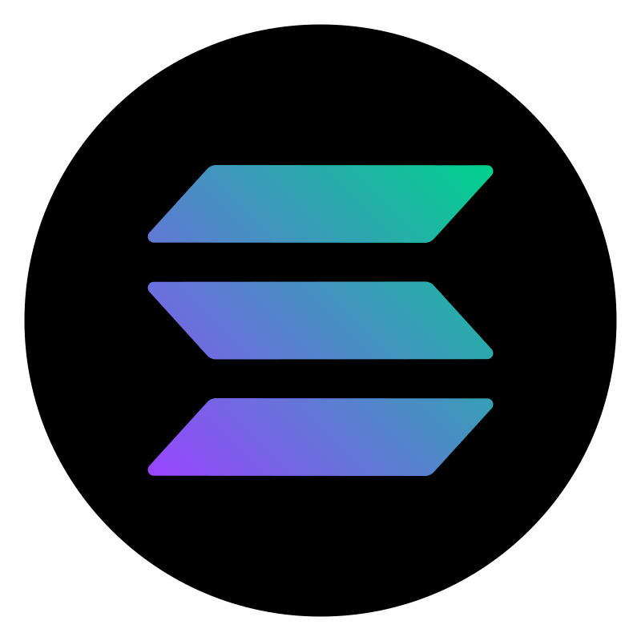

  

  

<h1 align="center">
</h1>

&nbsp;Creative, Passionate, and Efficient Senior Web3 & Cryptocurrency engineer with over 3+ years of experience in BlockChain and for 7+ years in web, mobile and desktop applications design, development, and maintenance. Possesses diverse experience of creating multiple highly scalable applications using different tech stacks. Leaded successful transition from MEAN & MERN Stack to Web3 & Cryptocurrency Stack to improve Web3 system performance which is the focus and the future of our life, so for now implemented <b>DApps</b>, <b>DeFi</n>, <b>NFT Marketplaces</b>, <b>NFT Mint Websites</b>, <b>Token Launchpads</b>. Have worked in all phases of the project life cycle, using a wide variety of tools and frameworks.

## Experienced Blockchain Networks

<table>
  <tr>
    <td align="center" width="96">
      
       Ethereum
    </td>
    <td align="center" width="96">
      
       Binance
    </td>
    <td align="center" width="96">
      
       Solana
    </td>
    <td align="center" width="96">
      
       Terra
    </td>
    <td align="center" width="96">
      
       Casper
    </td>
    <td align="center" width="96">
      
       Elrond
    </td>
    <td align="center" width="96">
      
       Polkadot
    </td>
    <td align="center" width="96">
      
       Avalanche
    </td>
    <td align="center" width="96">
      
       Polygon
    </td>
  </tr>
</table>
  
## Tools & languages

<table>
  <tr>
    <td align="center" width="96">
      
       JavaScript
    </td>
    <td align="center" width="96">
      
       TypeScript
    </td>
    <td align="center" width="96">
      
       Rust
    </td>
    <td align="center" width="96">
      
       Go
    </td>
    <td align="center" width="96">
      
       Python
    </td>
    <td align="center" width="96">
      
       NodeJs
    </td>
    <td align="center" width="96">
      
       React
    </td>
    <td align="center" width="96">
      
       Vue
    </td>
    <td align="center" width="96">
      
       Sass
    </td>
  </tr>
  <tr>
    <td align="center" width="96"> 
      
       Docker
    </td>
    <td align="center" width="96">
      
       Kubernetes
    </td>
    <td align="center"  width="96">
      
       Debian
    </td>
    <td align="center"  width="96">
      
       RHEL
    </td>
    <td align="center" width="96">
      
       Powershell
    </td>
    <td align="center"  width="96">
      
       MySQL
    </td>
    <td align="center" width="96">
      
       Grafana
    </td>
    <td align="center" width="96">
      
       Prometheus
    </td>
    <td align="center" width="96">
      
       Thanos
    </td>
  </tr>
</table>
